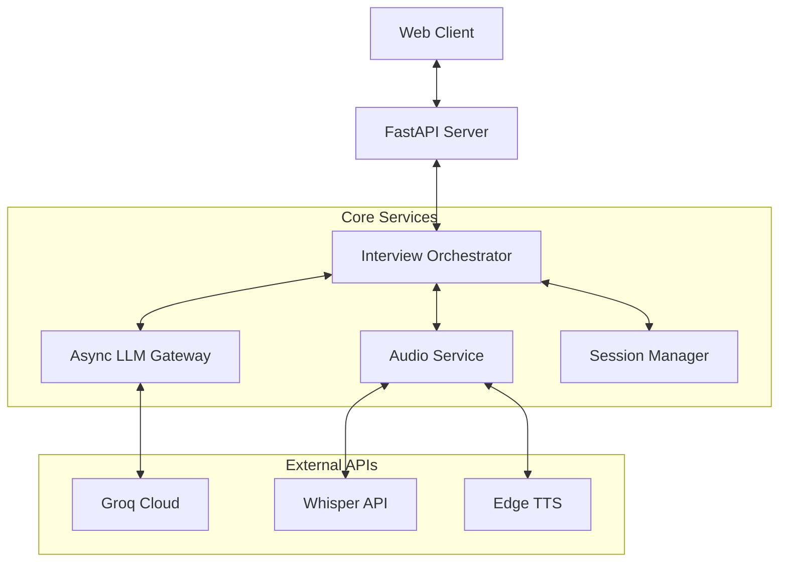
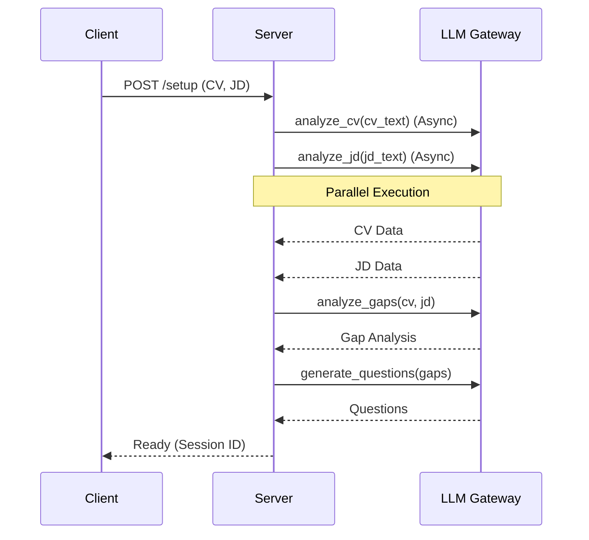

# NEXUS System Optimization & Architectural Redesign Plan

## 1. Current System Weakness Analysis

### A. Performance Bottlenecks
*   **Synchronous Blocking Calls:** The current implementation uses `time.sleep` (implied by synchronous requests) and blocking HTTP calls to Groq and Edge-TTS. This halts the entire server thread while waiting for external APIs, leading to high latency and poor concurrency.
*   **Sequential Execution:** The CV and JD analysis happens sequentially (`analyze_cv` then `analyze_jd`). These are independent tasks and should be parallelized to halve the setup time.
*   **Global State:** The use of a global `session` dictionary makes the server stateful in a dangerous way. It cannot handle multiple concurrent users and is prone to race conditions.
*   **Redundant IO:** Audio is saved to disk, read back, and then transcribed. Streaming or in-memory processing would be faster.

### B. Reliability Issues
*   **Error Handling:** Basic `try-except` blocks print errors but don't implement robust retry logic with exponential backoff for API rate limits or transient network failures.
*   **Zero-Shot Fragility:** The prompt engineering relies heavily on zero-shot instructions, which can lead to inconsistent JSON outputs.
*   **Hardcoded Configuration:** API keys and model names are hardcoded or loaded in a way that makes dynamic configuration difficult.

### C. Architectural Anti-Patterns
*   **God Object:** The `nexus_server.py` file contains server logic, business logic, LLM interaction, and file I/O. This violates the Single Responsibility Principle.
*   **Lack of Type Safety:** Heavy reliance on raw dictionaries (`dict`) makes the code brittle and hard to refactor. Keys are accessed via strings, leading to potential runtime `KeyError`s.

## 2. Root Cause Diagnosis

The root cause of the performance and reliability issues is the **synchronous, monolithic architecture**. The system was designed as a script wrapped in a web server, rather than an event-driven application. The lack of structured concurrency primitives (`asyncio`) means the CPU sits idle while waiting for network I/O. The lack of a proper data layer (Pydantic models) leads to fragile data handling.

## 3. Performance Optimization Strategy

### A. Asynchronous Core
*   **Migrate to `asyncio`:** All I/O-bound operations (LLM calls, STT, TTS) will be awaited.
*   **`aiohttp` / `httpx`:** Use asynchronous HTTP clients for external API calls.
*   **`asyncio.gather`:** Execute independent tasks (CV analysis, JD analysis) in parallel.

### B. Caching & State Management
*   **Session Manager:** Implement a `SessionManager` class to handle multiple concurrent sessions, stored in memory (with potential for Redis/DB backing).
*   **LRU Cache:** Cache frequent, identical LLM queries if applicable (e.g., standard definitions).

### C. Streaming
*   **Audio Streaming:** Stream audio bytes directly to STT service where possible, or use non-blocking file writes.

## 4. Architectural Redesign Proposal

### A. Layered Architecture

1.  **Presentation Layer (API):** `FastAPI` endpoints (`nexus_server_v2.py`). Handles HTTP requests/responses, input validation.
2.  **Orchestration Layer:** `InterviewOrchestrator` (`nexus_core/orchestrator.py`). Manages the interview flow (Gap -> Question -> Answer -> Score).
3.  **Service Layer:**
    *   `AsyncLLMGateway` (`nexus_core/llm_gateway.py`): Handles Groq API interactions, retries, key rotation.
    *   `AudioService`: Handles STT and TTS interfaces.
4.  **Data Layer:** `Pydantic` models (`nexus_core/structs.py`). Defines the schema for `CV`, `JD`, `Question`, `Score`, `Session`.

### B. Data Flow
*   **Setup:** Request -> API -> Orchestrator -> (Parallel: LLM-CV, LLM-JD) -> LLM-Gap -> Response.
*   **Interview Loop:** Audio -> API -> AudioService(STT) -> Orchestrator -> LLM-Score -> LLM-Decision -> LLM-Response -> AudioService(TTS) -> Response.

## 5. Diagrams

### System Architecture

### Sequence: Setup Phase

## 6. Prompt Engineering Improvements

*   **Structured Outputs:** Enforce JSON schemas strictly. Use Pydantic models to validate LLM outputs.
*   **Chain-of-Thought:** Embed `<thinking>` steps in system prompts to improve reasoning before JSON generation.
*   **Context Management:** Prune conversation history to keep prompt tokens efficient.

## 7. Reliability Framework

*   **Key Rotation:** Implement a round-robin key selector for Groq API to handle rate limits.
*   **Exponential Backoff:** `tenacity` library or custom decorator for retrying failed API calls.
*   **Fallback Models:** Automatically downgrade to smaller models (e.g., Llama 8B) if the primary model fails or times out.
